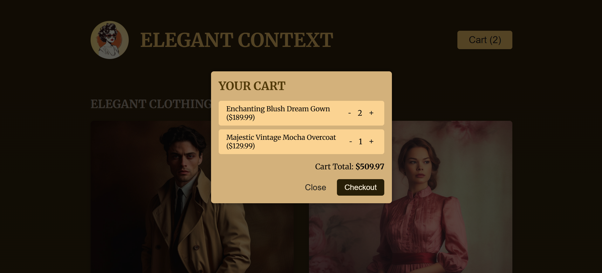

# 🛒 Section 10 – Context API & useReducer: Shopping Cart

This project is a shopping cart interface that demonstrates how to manage **global state** in React using the **Context API** and **`useReducer`**. It simulates an e-commerce experience where users can add items to a cart, adjust quantities, and open a cart modal.

---

## 🚀 Overview

Users can:
- Browse a list of fashion products
- Add items to a shopping cart
- Increase/decrease item quantity in the cart
- View the cart in a modal overlay

---

## 📸 Screenshots

---

## 🧠 Key Concepts Practiced

- 🧩 Creating a **context** for global state (`CartContext`)
- ⚙️ Using **`useReducer`** to manage complex cart logic (add/update/remove)
- 🧠 Sharing logic between components via `useContext`
- 📦 Using `createPortal` for rendering a cart modal outside the DOM root
- 🧮 Calculating total prices and syncing cart state dynamically

---

## 🧩 Component Overview

- `CartContextProvider.jsx` – Global cart logic using context + reducer
- `Cart.jsx` – Displays cart items with quantity controls
- `CartModal.jsx` – Cart UI rendered in a modal using portals
- `Header.jsx` – Button to open the cart modal and show item count
- `Product.jsx` – Single product UI with “Add to Cart” functionality
- `Shop.jsx` – Displays product list from dummy data

---

## 💡 What I Learned

- How to combine **Context API** with `useReducer` for scalable state management
- Separating UI logic from data flow for clean React architecture
- Keeping components reusable and focused on a single purpose

---

> This project reinforces how React's context and reducer patterns can replace prop drilling and handle complex shared state cleanly.
