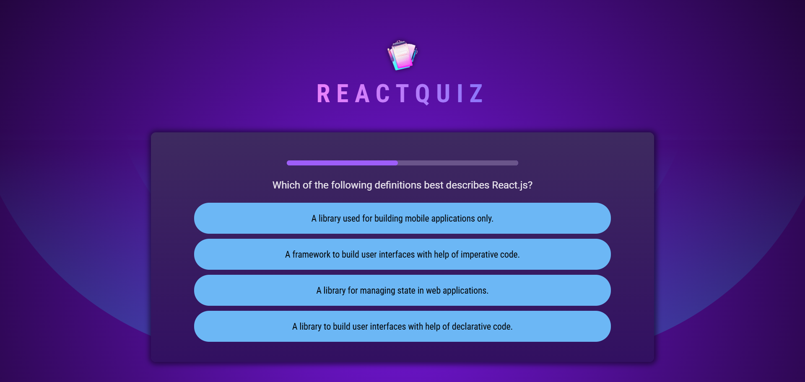

# 🧠 Section 12 – Practice Project: Quiz App

This project is a fully interactive **React Quiz Application** built to reinforce advanced state handling, component structure, and conditional rendering. It provides a timed, question-based quiz with animated feedback and a detailed result summary.

---

## 🚀 Overview

Users can:
- Answer multiple-choice quiz questions with shuffled answers
- Receive animated visual feedback based on their response
- Skip unanswered questions
- View a full **results summary** at the end showing correct, wrong, and skipped answers

---

## 📸 Screenshot

---

## 🧠 Key Concepts Practiced

- ⏱️ Managing timers using `useEffect` and `setTimeout`
- 🔄 Conditional rendering and UI feedback based on answer state
- 📊 Tracking user progress and summarizing results dynamically
- 🎨 Styling feedback with animated class transitions
- 📦 Component composition: `Question`, `Answers`, `Timer`, `Summary`

---

## 🧩 Component Overview

- `App.jsx` – Main container for the app
- `Quiz.jsx` – Handles the quiz flow and question state
- `Question.jsx` – Displays each question and its logic
- `Answers.jsx` – Handles answer rendering, selection, and animation
- `QuestionTimer.jsx` – Controls timing for answers and transitions
- `Summary.jsx` – Displays quiz completion stats and user performance

---

## 💡 What I Learned

- Building time-sensitive UI interactions
- Creating multi-stage component flows with feedback
- Structuring quiz logic with fallback for skipped answers
- Combining React fundamentals to build a real-world app

---

> A fun and educational React project that applies everything learned so far into one smooth user experience.
